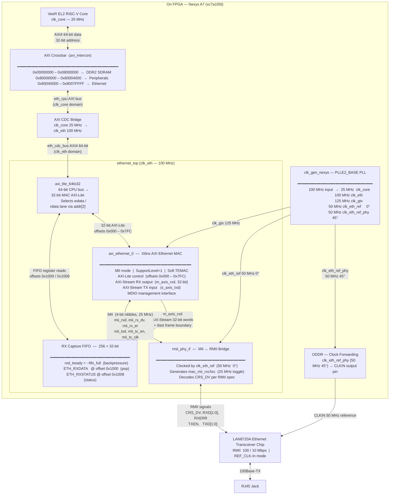

# EthTest — Architecture Diagram & Register Map

---

## System Block Diagram



---

## ethernet\_top Register Map

All registers are 32-bit wide and accessed as `unsigned int` from firmware.
The Ethernet peripheral base address is **`0x80040000`**.

Addresses `0x80040000` – `0x80040FFF` (offset `0x000` – `0xFFF`) are forwarded to the
Xilinx AXI Ethernet MAC through the `axi_lite_64to32` width converter.

Addresses `0x80041000` – `0x8007FFFF` (offset `0x1000` – `0x3FFFF`) are decoded by
`ethernet_top` and service the internal RX Capture FIFO registers.

---

### MAC Control / Status Registers (Xilinx DS759)

| Register | CPU Address | Offset | Bit Field | Access | Reset Value | Description |
|---|---|---|---|---|---|---|
| **RAF** | `0x80040000` | `0x000` | `[2]` BcstRej | R/W | `0x0000_0000` | Receive Address Filter. `BcstRej=0` accepts broadcast frames (default). Set bit 2 to reject broadcasts. |
| **IS** | `0x8004000C` | `0x00C` | `[7]` MgtRdy | RO | — | Management Ready. Set to 1 once PHY MDIO is initialised. Always 1 in steady state. |
| | | | `[6]` RxDcmLock | RO | — | RX DCM lock. Always 1 (no DCM in MII mode). |
| | | | `[4]` RxMemOvr | W1C | `0` | RX Memory Overflow. Set if MAC's internal RX FIFO overflows. Cleared by writing 1. |
| | | | `[3]` RxRject | W1C | `0` | Frame Rejected. Set when a received frame is discarded (bad CRC, address mismatch, etc.). Write 1 to clear. |
| | | | `[2]` RxCmplt | W1C | `0` | Frame Complete. Set when a full frame has been received and transferred to the AXI-Stream. Write 1 to clear. |
| **RCW1** | `0x80040404` | `0x404` | `[28]` RX\_EN | R/W | `0x1000_FFFF` | Receiver Enable. **Must be set to 1** to enable frame reception. Write `(1u << 28)`. |
| | | | `[27]` Vlan | R/W | — | VLAN frame enable. Leave 0 for standard frames. |
| | | | `[26]` HD | R/W | — | Half-duplex enable. Leave 0 for full-duplex. |
| **EMMC** | `0x80040410` | `0x410` | `[31:30]` MAC\_SPEED | R/W | `0x8000_0000` | MAC speed. `10` = 1 Gbps (reset default — **wrong for 100M**), `01` = 100 Mbps, `00` = 10 Mbps. Write `(1u << 30)` to select 100 Mbps. |

---

### RX Capture FIFO Registers (ethernet\_top custom, offset ≥ 0x1000)

Reads to these offsets are intercepted by `ethernet_top` and never forwarded to the MAC.

| Register | CPU Address | Offset | Bit Field | Access | Reset Value | Description |
|---|---|---|---|---|---|---|
| **ETH\_RXDATA** | `0x80041000` | `0x1000` | `[31:0]` data | R (destructive) | — | Pop one 32-bit word from the head of the RX Capture FIFO. Each read advances the read pointer by one entry. Returns `0xDEADBEEF` if the FIFO is empty. Read ETH\_RXSTATUS first to confirm the FIFO is not empty. |
| **ETH\_RXSTATUS** | `0x80041008` | `0x1008` | `[31:24]` frame\_count | RO | `0x0000_0001` | Number of complete (tlast-terminated) frames currently in the FIFO. Increments when a frame's last word is written; decrements when that word is read out. |
| | | | `[17:9]` word\_count | RO | — | Total 32-bit words currently stored in the FIFO (0 – 256). |
| | | | `[8]` tlast | RO | — | The `tlast` flag of the word at the current read pointer. Indicates the head word is the last word of its frame. |
| | | | `[1]` full | RO | — | FIFO full flag. Set when all 256 entries are occupied. The MAC will be backpressured (rxd\_tready = 0) while full; new data is held in the MAC's internal buffer. |
| | | | `[0]` empty | RO | `1` | FIFO empty flag. **Poll this bit before reading ETH\_RXDATA.** `1` = no data available. |

---

### Firmware Usage Pattern (EthTest `main.c`)

```c
/* Initialisation */
ETH_SPEED = (1u << 30);   // EMMC[31:30] = 01 → 100 Mbps
ETH_RCW1  = (1u << 28);   // RCW1[28]    = 1  → receiver enable
ETH_IS    = 0x0Cu;         // Clear any stale RxCmplt / RxRject bits

/* Poll loop */
unsigned int status = ETH_IS;
if (status & 0x04u)        // RxCmplt (IS bit 2)
{
    /* Drain the FIFO one word at a time */
    while (!(ETH_RXSTATUS & 0x1u))   // while not empty
    {
        unsigned int word = ETH_RXDATA;  // pops one word
        /* TODO: write word to VGA framebuffer (skip first 4 words = 14-byte Eth header) */
    }
    ETH_IS = 0x04u;    // W1C: clear RxCmplt
}
if (status & 0x08u)    // RxRject (IS bit 3)
    ETH_IS = 0x08u;    // W1C: clear RxRject
```

---

### Address Map Summary

| Region | CPU Address Range | Size | Target |
|---|---|---|---|
| Peripherals | `0x80000000` – `0x80003FFF` | 16 KB | GPIO, UART, timers, etc. |
| **Ethernet** | **`0x80040000` – `0x8007FFFF`** | **256 KB** | **ethernet\_top** |
| — MAC registers | `0x80040000` – `0x80040FFF` | 4 KB | Forwarded to axi\_ethernet\_0 |
| — RX FIFO regs | `0x80041000` – `0x8007FFFF` | 252 KB | Decoded by ethernet\_top |
| DDR2 SDRAM | `0x00000000` – `0x07FFFFFF` | 128 MB | litedram |
